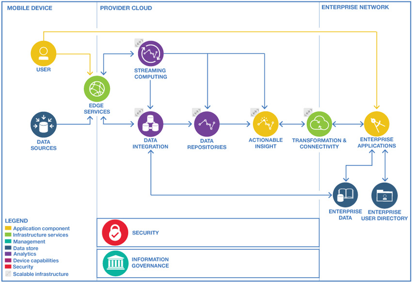
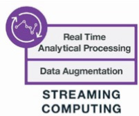
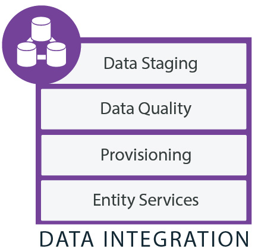

# 智慧醫療雲 - 睡眠呼吸中止症的判斷及醫療建議
## Functional Description
1. 透過手機的資訊分析病人是否碰到疑似睡眠障礙問題　 
例：從對話紀錄、搜尋紀錄得知病人最近是否碰到疑似症狀。
2. 透過睡眠資訊判斷病人是否有睡眠呼吸中止症 ( Possibility )  
例：從 apnea module 判斷病人整晚睡眠發生幾次CSA, OSA, Hypopenea ，並判斷具有輕度、中度或重度風險。
3. 透過手機的資訊分析病人的生活習慣是否造成 sleep apnea  
例：病人是否熬夜，飲食習慣。
4. 透過病歷與生活習慣、手機資訊交叉比對病因  
例：是否飲食造成過重而致sleep apnea, 是否因天氣影響氣管收縮。
5. 透過病因與症狀判斷是否有潛在其他病症
例：有沒有高血壓、心血管疾病風險。
6. 根據結果提供求醫建議  
例：掛號科別、檢查項目。
7. 根據病症、病歷、與生活習慣給予醫生治療建議  
例：是否在睡眠中心詳細監測整晚睡眠訊號、是否指示病人改變生活習慣、開藥建議。
8. 提供語音對話問診建議  
例：透過語音問答了解病人病徵，並給予正確病症相關知識。
9. 針對環境與病人狀況給予生活建議 (警示)  
例：飲食熱量提醒、天氣是否太冷需要早歸。

---
## Issue - It's all about Data

### Big Data issues - 4V's

1. Volume 資料量  
  紀錄病人的各種活動、文字、影像需要非常大量的取樣資料 (sample/reference) 和測試 (test) 資料。
2. Variety 資料多元性 
  Struct data - 病歷、睡眠測試結果 (From DSP module) 、病人活動資訊 (From mobile)  
  Non-structured data - Text. image. voice. metadata
3. Velocity 資料即時性 
  病人資料進來後，要能即時分析，除了回饋以外，要能自我學習，把不必要的資料清空 (Clean up)，將有用的資訊保存
4. Veracity 資料正確性 
  必須嚴謹挑選 sample data ，需要判斷資料是否是我們需要的資訊，資料是否有假，資料是否有異常值

---
## IBM Big Data Analytics in The Cloud -  Cloud Customer Architecture for Big Data and Analytics

Cloud Customer Architecture for Big Data and Analytics 是一個由 Cloud Standards Customer Council (CSCC) 提出來的大數據分析的架構。其架構由3個網路組成，包括 Public Network. Provider Cloud. 和 Enterprise Network 。

### Public Network

資料會從 User 端的 SaaS Application ，或是從公共資源中，透過 Edge Services ，將資料輸入。在這裡，我們可以理解 SaaS 就是使用者的 App ，而 Edge Services 簡單來說就是一個 protocal/firewall/load balancer ，確定好資料是從 user 端來的，同時也確定好資料要往哪個伺服器運送。

### Provider Cloud

資料進來後，會分成兩種類型處理

#### Streaming Computing

Stream Computing 可以從各樣的輸入取得/處理大量、高度動態，且有時效性、持續的數據流 (stream)，以我們使用的例子而言，就是病人的呼吸訊號監測，或是病人平日的活動監測。

Stream Computing 包含兩個特點
1. Real-time analytical processing  
以最低延遲對於儲存進來的資料做分析和決策。
2. Data augmentation  
將資料過慮後放進 Data integration 作更進一步的 background 分析。

Stream Computing 要能隨著使用量或速度的需求增加/減少使用量。

#### Data Integration

Data Integration 從各種不同的來源複製資訊，並能讓不同的資訊間產生關聯 (correlates information) ，一個完整的 Data integration 必須要能發現數據來源的特徵 (characteristics)，清理、監控、轉換，和運送 data 。其功能應包括

1. Data stagging  
將 data 轉換成適合的格式交給下游處理
2. Data quality  
清理和組織 data ，以便消除冗餘 (redundancies) 和不一致性 (inconsistencies) ，讓 data 滿足使用者的需求。
3. Provisioning
轉換、管理以及將 data 交給適合的目標， provisioning 可以在不同的 data repositories 移動 data ，從 data source 轉移 data 出來/進入 (to/from) 。
4. Entity services
從不同的來源匹配 data ，以便為關鍵實體 (key entities) 提供更完整的視野 (view) 。

---
## Reference
[大數據到底是什麼意思？事實上，它是一種精神！](https://hellolynn.hpd.io/2017/06/09/)
