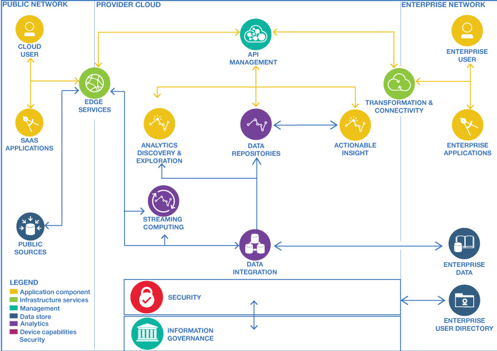
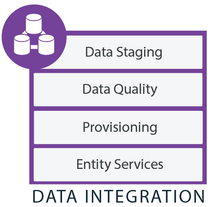
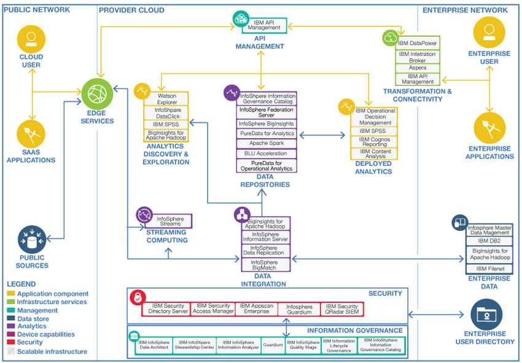

# 智慧醫療雲 - 睡眠呼吸中止症的判斷及醫療建議
## Functional Description
1. 透過手機的資訊分析病人是否碰到疑似睡眠障礙問題　 
例：從對話紀錄、搜尋紀錄得知病人最近是否碰到疑似症狀。

2. 透過睡眠資訊判斷病人是否有睡眠呼吸中止症 ( Possibility )  
例：從 apnea module 判斷病人整晚睡眠發生幾次CSA, OSA, Hypopenea ，並判斷具有輕度、中度或重度風險。

3. 透過手機的資訊分析病人的生活習慣是否造成 sleep apnea  
例：病人是否熬夜，飲食習慣。

4. 透過病歷與生活習慣、手機資訊交叉比對病因  
例：是否飲食造成過重而致sleep apnea, 是否因天氣影響氣管收縮。

5. 透過病因與症狀判斷是否有潛在其他病症
例：有沒有高血壓、心血管疾病風險。

6. 根據結果提供求醫建議  
例：掛號科別、檢查項目。

7. 根據病症、病歷、與生活習慣給予醫生治療建議  
例：是否在睡眠中心詳細監測整晚睡眠訊號、是否指示病人改變生活習慣、開藥建議。

8. 提供語音對話問診建議  
例：透過語音問答了解病人病徵，並給予正確病症相關知識。

9. 針對環境與病人狀況給予生活建議 (警示)  
例：飲食熱量提醒、天氣是否太冷需要早歸。

---
## Issue - It's all about Data

### Big Data issues - 4V's

1. **Volume 資料量**  
  紀錄病人的各種活動、文字、影像需要非常大量的取樣資料 (sample/reference) 和測試 (test) 資料。

2. **Variety 資料多元性** 
  Struct data - 病歷、睡眠測試結果 (From DSP module) 、病人活動資訊 (From mobile)  
  Non-structured data - Text. image. voice. metadata

3. **Velocity 資料即時性** 
  病人資料進來後，要能即時分析，除了回饋以外，要能自我學習，把不必要的資料清空 (Clean up)，將有用的資訊保存

4. **Veracity 資料正確性** 
  必須嚴謹挑選 sample data ，需要判斷資料是否是我們需要的資訊，資料是否有假，資料是否有異常值 [1]

---
## IBM Big Data Analytics in The Cloud -  Cloud Customer Architecture for Big Data and Analytics

Cloud Customer Architecture for Big Data and Analytics [2] 是一個由 Cloud Standards Customer Council (CSCC) [3] 提出來的大數據分析的架構。其架構由3個網路組成，包括 Public Network. Provider Cloud 和 Enterprise Network 。 IBM 的，主要 solution 就是使用此架構 [4]。

### Public Network

資料會從 User 端的 SaaS Application ，或是從公共資源中，透過 Edge Services ，將資料輸入。在這裡，我們可以理解 SaaS 就是使用者的 App ，而 Edge Services 簡單來說就是一個 protocal/firewall/load balancer ，確定好資料是從 user 端來的，同時也確定好資料要往哪個伺服器運送。

### Provider Cloud

資料進來後，會分成兩種類型處理

#### Streaming Computing

Stream Computing 可以從各樣的輸入取得/處理大量、高度動態，且有時效性、持續的數據流 (stream)，以我們使用的例子而言，就是病人的呼吸訊號監測、病人平日的活動監測，或是病人的問診系統。

Stream Computing 包含兩個特點
1. **Real-time analytical processing**  
以最低延遲對於儲存進來的資料做分析和決策。

2. **Data augmentation**  
將資料過慮後放進 Data integration 作更進一步的 background 分析。Stream Computing 要能隨著使用量或速度的需求增加/減少使用量。

#### Data Integration

Data Integration 從各種不同的來源複製資訊，並能讓不同的資訊間產生關聯 (correlates information) ，一個完整的 Data integration 必須要能發現數據來源的特徵 (characteristics)，清理、監控、轉換，和運送 data 。其功能應包括

1. **Data stagging**  
將 data 轉換成適合的格式交給下游處理

2. **Data quality**  
清理和組織 data ，以便消除冗餘 (redundancies) 和不一致性 (inconsistencies) ，讓 data 滿足使用者的需求。
3. **Provisioning**  
轉換、管理以及將 data 交給適合的目標， provisioning 可以在不同的 data repositories 移動 data ，從 data source 轉移 data 出來/進入 (to/from) 。

4. **Entity services**  
從不同的來源匹配 data ，以便為關鍵實體 (key entities) 提供更完整的視野 (view) 。

#### Data Repositories

Data Repositories 是 data 主要儲存的儲存庫，可以使用不同的平台，例如： Hadoop, NoSQL 。儲存在儲存庫中的 data 有可能來自遺留的 (legacy) 、新的、串流來源、企業的應用程式、企業的資料、已清理或是從串流分析輸出的資料。

Data repositories 包含以下幾個類型：

1. **Catalog**  
來自 discovery 和 IT 資料組織的結果建立一個目錄，來提供一個反應信息 (information) 的視角 (view) 。Big data 的引入使得資料庫對於儲存資料的內容、分類、所有權、信息的相關性需求增加，從這個目錄，使用者可以控制資料的使用。

2. **Data virtualization**  
允許應用程式可以快速的 (Agile) 檢索和操作資料，而不需要關於資料的技術細節、落地、探索和歸檔：允許使用各種工具來儲存、探索和擴充大型的資料集合。因為大規模和非結構性 (non-structured) 的資料引入，意味著"在資料輸入前就設計資料庫"的這個方法已經不再可行。資料可以用於存檔，可以藉由分散在各個儲存空間的副本，來獲得更高的可靠性和恢復能力。

3. **Deep analytics and modeling** 
應用統計模型可以從非結構化和半結構化 (semi-structured) 的大型資料集合中獲得信息。深度分析從　PB(petabytes) 和 EB(Exabytes) 中取得精確的結過。 未來在即時的或接近即時性的 (near real-time) 的反應需求會越來越普遍。

4. **Interactive analysis and reporting** 
針對自助資料訪問可視化，用應用程式操作 API 訪問資料庫。

5. **Data warehousing** 
歷史資料、摘要資料或是其他來源的資料儲存的地方，通常會放主題導向的、非揮發性的時序資料 (time-series data) ，這些資料可以用於企業決策。通常工作量是密集的，會訪問數百萬條來方便掃描、合併和聚合，吞吐量 (throughput) 和反應時間通常是最優先考量。

####  Analytics Discovery & Exploration

1. **Self-service**  
用戶能夠自己註冊，訪問來自分析系統的輸出，能自己定義分析處理。

2. **Visualization**  
用戶可以自行建立儀表板來探索資料庫，可以操作觀察數據。

3. **Data preparation**  
使用戶能將資料從原始型式轉換成更容易分析的格式。

4. **Sandbox**  
把資料複製到一個私有區域來進行沙盒實驗。

#### Deployed Analytics

Deployed Analytics 是一個 anylistcs applications 的集合，其用來
* 基於分析的決策管理，使組織能夠制定經過分析的自動化決策。
* 預測分析服務，從現有的資訊和資料來識別模型 (patterns) ，預測未來趨勢。
* 分析並向管理者報告和操作資料庫。
* 內容分析服務，讓使用者觀察並理解結構化和非結構化的資料。公司內大部分的訊息被作為非結構化資料來維護，例如文件、資料庫中的本文片斷、 Wikis 等內容。
* 計劃和預報 (forecasting) 未來的場景。

### Enterprise Network

Enterprise network 包含了 enterprise applications ，以及 enterprise data  

#### Enterprise Data

Enterprise Data 承載著應用程式裡面的關鍵資料，包含

1. **Reference data**  
提供有效值或查找資料（例如：zip code）。

2. **Maser data**  
儲存關鍵實體的屬性 (attributes) ，例如：帳戶資料。

3. **Transactional data**

4. **Application data**

5. **Log data**

6. **Enterprise content data**

7. **Historical data**

### Overview

---
## Azure solution for Big Data Analytics

* **資料來源**：所有的巨量資料解決方案都是從一個或多個資料來源來做為開端。 範例包括：
  * 應用程式資料存放區，例如關聯式資料庫。
  * 應用程式所產生的靜態檔案，例如 Web 伺服器記錄檔。
  * 即時資料來源，例如 IoT 裝置。

* **資料存放區**：要進行批次處理作業的資料通常儲存在分散式檔案存放區，以便能夠保存大量具有不同格式的大型檔案。 這種存放區通常稱為「資料湖」。 可供實作此儲存體的選項包含 Azure Data Lake Store 或 Azure 儲存體中的 Blob 容器。

* **批次處理**：由於資料集是如此龐大，巨量資料解決方案通常必須使用需要長時間執行的批次作業來處理資料檔案，以便篩選、彙總和準備資料以供分析。 這些作業通常涉及讀取原始程式檔、加以處理，然後將輸出寫入至新的檔案。 選項包括在 Azure Data Lake Analytics 中執行 U-SQL 作業、在 HDInsight Hadoop 叢集中使用 Hive、Pig 或自訂的 Map/Reduce 作業，或是在 HDInsight Spark 叢集中使用 Java、Scala 或 Python 程式。

* **即時訊息擷取**：如果解決方案中包含即時來源，則架構中必須有方法可擷取和儲存即時訊息以進行串流處理。 這可能是簡單的資料存放區，內送訊息會放入資料夾處理。 不過，許多解決方案需要有訊息擷取存放區，以做為訊息的緩衝區，以及支援相應放大處理、可靠的傳遞和其他訊息佇列語意。 選項包括 Azure 事件中樞、Azure IoT 中樞和 Kafka。

* **串流處理**：在擷取即時訊息後，解決方案必須經由篩選、彙總和準備要分析的資料，以便處理這些資料。 已處理的串流資料接著會寫入至輸出接收器。 Azure 串流分析會根據永久執行的 SQL 查詢 (會針對未繫結資料流進行操作) 提供受管理的串流處理服務。 您也可以使用開放原始碼的 Apache 串流技術，例如 HDInsight 叢集中的 Storm 和 Spark 串流。

* **分析資料存放區**：許多巨量資料解決方案會準備資料以供分析，然後以可使用分析工具來查詢的結構化格式提供處理過的資料。 用來提供這些查詢的分析資料存放區可以是 Kimball 樣式的關聯式資料倉儲，如同我們在大部分的傳統商業智慧 (BI) 解決方案所看見的。 或者，我們也可以透過低延遲的 NoSQL 技術 (例如 HBase) 或是互動式 Hive 資料庫 (可針對分散式資料存放區中的資料檔案提供中繼資料擷取) 來呈現資料。 Azure SQL 資料倉儲可提供受管理的服務供大規模的雲端式資料倉儲使用。 HDInsight 則支援互動式 Hive、HBase 和 Spark SQL，它們也可用來提供要分析的資料。

* **分析和報告**：大部分巨量資料解決方案的目標，是要透過分析和報告提供資料的深入見解。 為了讓使用者能夠分析資料，架構中可能要包括資料模型化層，例如 Azure Analysis Services 中的多維度 OLAP Cube 或表格式資料模型。 架構也可能會支援自助商業智慧，其使用的是 Microsoft Power BI 或 Microsoft Excel 中的模型化和視覺效果技術。 分析和報告也可供資料科學家或資料分析師透過互動方式瀏覽資料。 針對這些案例，許多 Azure 服務支援了分析筆記本 (例如 Jupyter)，讓這些使用者能夠利用其現有的技巧來使用 Python 或 R。若要瀏覽大規模的資料，您可以使用 Microsoft R Server (不論是獨立使用或搭配 Spark 來使用)。

* **協調流程**：大部分的巨量資料解決方案都包含重複的資料處理作業並封裝在工作流程中，這些作業會轉換來源資料、在多個來源和接收器之間移動資料、將處理過的資料載入分析資料存放區，或將結果直接推送到報告或儀表板。 若要讓這些工作流程自動執行，您可以使用協調流程技術，例如 Azure Data Factory 或 Apache Oozie 和 Sqoop。

Azure 也有對於 Big data analytics 的 solution [5],[6]，與 CSCC 提出架構有部份相同，例如資料進來後也分成 straming comuting 和 data integration，分析資料存放區理應與 data repositories 功能相同，也同樣有分析和報告，不同之處在於，在 Azure 中是較沒有架構，不過看起來所有的 components 都可以在 Azure marketplace 找到，也就是說,只要有 CSCC 的架構， Azure 也能兜出一樣的 Big data anylitics cloud 。

另外，目前 CSCC 提出的 Cloud Customer Architecture for Big Data and Analytics 目前是 V2.0 ，如果你上他們的網站的話，就會看到在 12/19 他們即將發佈 V3.0 的架構。

---
## Reference

[1] [大數據到底是什麼意思？事實上，它是一種精神！](https://hellolynn.hpd.io/2017/06/09/)

[2] [Cloud Customer Architecture for Big Data and Analytics V2.0](http://www.cloud-council.org/deliverables/CSCC-Cloud-Customer-Architecture-for-Big-Data-and-Analytics.pdf)

[3] [Cloud Standards Customer Council](http://www.cloud-council.org/)

[4] [How IBM leads in building big data analytics solutions in the cloud](https://www.ibm.com/developerworks/cloud/library/cl-ibm-leads-building-big-data-analytics-solutions-cloud-trs/index.html#N10315)

[5] [Understanding Microsoft big data solutions](https://msdn.microsoft.com/zh-tw/library/dn749804.aspx)

[6] [巨量資料架構樣式](https://docs.microsoft.com/zh-tw/azure/architecture/guide/architecture-styles/big-data)
